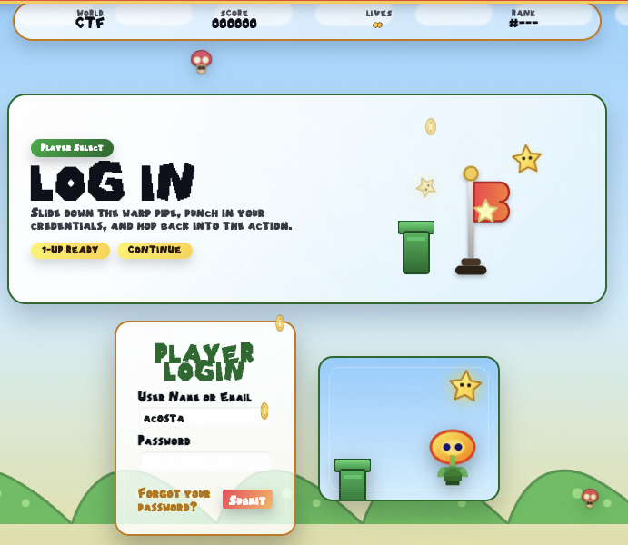
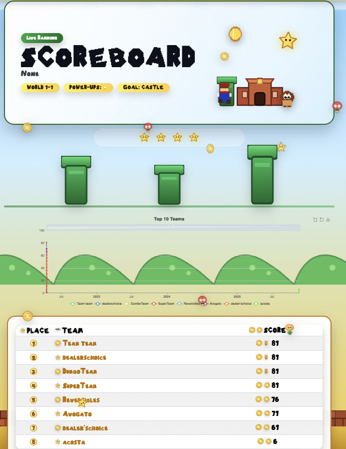
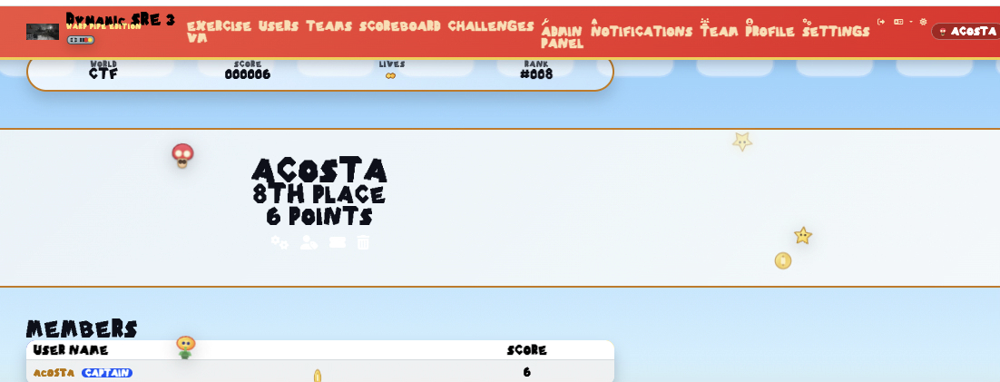

# Warp Pipe CTF Theme

## Quick Install

1. Download the latest `super-plumberman-theme.zip` release asset.
2. Unzip the contents directly into `CTFd/themes/super-plumberman` (create the folder if it does not exist).
3. Restart CTFd if necessary, then pick **Super Plumberman** under **Admin → Config → Theme** and hard-refresh your browser.

Warp Pipe is a Superplumber-inspired reskin of the official CTFd core theme. It keeps the Bootstrap 5 + Alpine.js foundation but swaps in chunky pixel fonts, glowing gradients, floating coins, and parallax scenery so your scoreboard feels like it lives inside World 1-1. All art assets here are original vectors created specifically for this project.

## Feature Highlights

- **Fresh palette & typography** – Nintendo's Superplumber Maker font family everywhere, plus updated buttons, cards, and nav pills.
- **Layered skyline** – animated clouds, hills, brick floors, and question blocks that respect `prefers-reduced-motion`.
- **Question-block challenges** – hover lift, solved green glow, and soft shadows keep the board playful without sacrificing usability.
- **Floating coins** – micro-animation powered by `assets/js/theme/superplumber.js` for extra whimsy (easy to disable).
- **Warp-ready scoreboard** – pill headers, neon badges, and softened tables align with the Superplumber look while staying readable.

## Quick Start

Clone the theme next to your CTFd install or develop it standalone:

```bash
git clone https://github.com/CTFd/core-beta.git super-plumberman-theme
cd super-plumberman-theme
```

Install dependencies (Yarn 1.x or modern npm-compatible Yarn works fine):

```bash
yarn install
```

During development run the watch build so Vite recompiles on save:

```bash
yarn dev
```

Create a production build before packaging or syncing into `CTFd/themes`:

```bash
yarn build
```

Copy the resulting directory (excluding `node_modules`) into `CTFd/themes/super-plumberman` and select it inside the CTFd admin UI.

## Customization Pointers

| Area | Files to tweak |
| --- | --- |
| Colors, gradients, parallax layers | `assets/scss/main.scss` |
| Fonts & icon faces | `assets/scss/includes/utils/_fonts.scss` |
| Superplumber artwork (clouds, bricks, coins…) | `assets/img/superplumber/` |
| Floating coins / particle logic | `assets/js/theme/superplumber.js` (imported by `assets/js/page.js`) |
| Layout wrappers & navbar markup | `templates/base.html`, `templates/components/navbar.html` |

The background animation automatically disables when visitors opt into reduced motion. Remove the `import "./theme/superplumber";` line from `assets/js/page.js` if you prefer a static scene.

## Available Scripts

| Script | Description |
| --- | --- |
| `yarn dev` | Runs `vite build --watch` for iterative development |
| `yarn build` | Produces an optimized build in `static/` |
| `yarn format` | Applies Prettier to everything under `assets/` |
| `yarn lint` | Checks formatting without modifying files |
| `yarn verify` | Production build + git diff cleanliness check |
| `yarn fetch:superplumber-font` | Downloads the Superplumber font binaries into `assets/webfonts/` (auto-runs before dev/build). Copy the Mario World Pixel font manually as noted below. |

## Font Licensing

- **Typeface Mario World Pixel (Filled)** – primary display/body font. License: [Creative Commons BY-NC-ND](https://creativecommons.org/licenses/by-nc-nd/4.0/) (Attribution, Non-commercial, No Derivatives). Download it from FontSpace: https://www.fontspace.com/typeface-mario-world-pixel-font-f56447 and place the `TypefaceMarioWorldPixelFilledRegular.otf` file into `assets/webfonts/`.
- **Superplumber Maker + Superplumber Solid** – fallback Nintendo-inspired fonts fetched via `yarn fetch:superplumber-font`, still ignored from git.

Because all of the above are third-party binaries, they remain untracked in git; make sure they exist locally before running `yarn build`.

## Release ZIP for CTFd

When you just want to install the theme (no build tools required):

1. Download the `super-plumberman-theme.zip` asset from the GitHub Releases page.
2. Extract the archive and copy the resulting folder into your CTFd instance under `CTFd/themes/super-plumberman` (create the directory if it does not exist).
3. Restart CTFd (if needed) and select "Warp Pipe" from **Admin > Config > Theme**.

The ZIP already contains the compiled `static/` assets, templates, and required fonts, so CTFd can use it immediately.

### Rebuilding the ZIP

If you modify the theme and need a new release package, run:

```bash
yarn build
mkdir -p dist
zip -r dist/super-plumberman-theme.zip assets templates static README.md LICENSE.md package.json postcss.config.js vite.config.js scripts .prettierrc.json .prettierignore yarn.lock
```

Upload the freshly generated `dist/super-plumberman-theme.zip` as a release asset.

## Screenshots

| Login | Scoreboard |
| --- | --- |
|  |  |

| Challenges | Profile |
| --- | --- |
|  |  |

## Directory Layout

```
assets/    -> authoring sources (SCSS, JS, images, sounds)
static/    -> compiled output served by CTFd
templates/ -> Jinja templates for each CTFd page
```

Have fun storming the castle! 🎮
